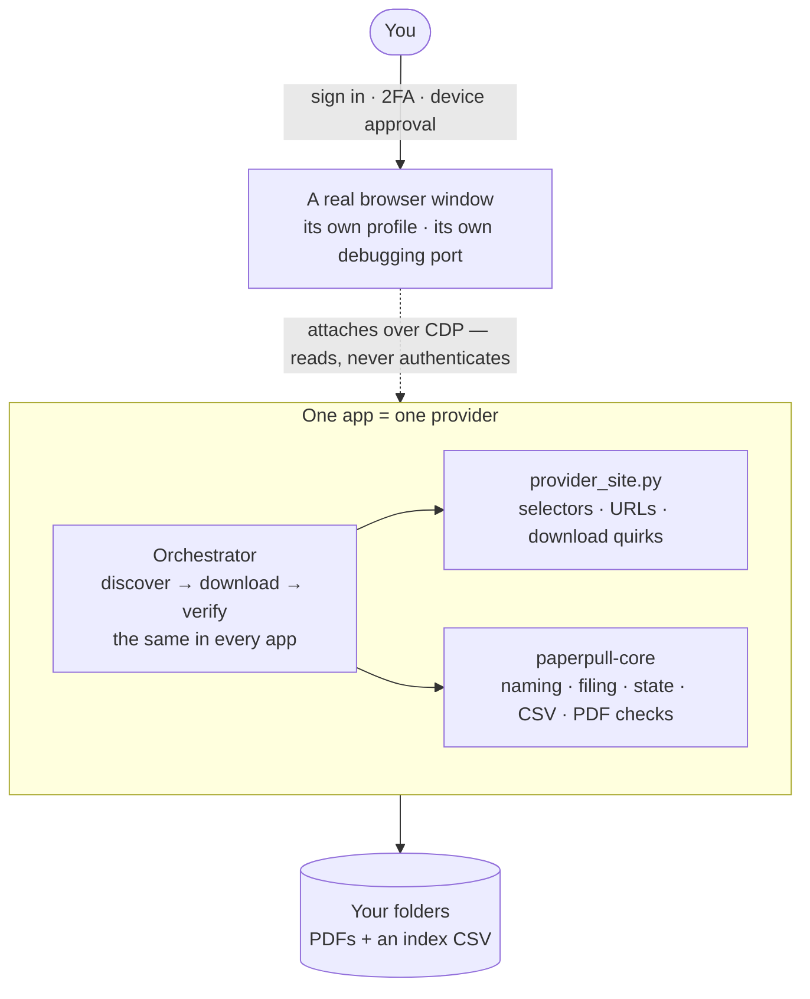
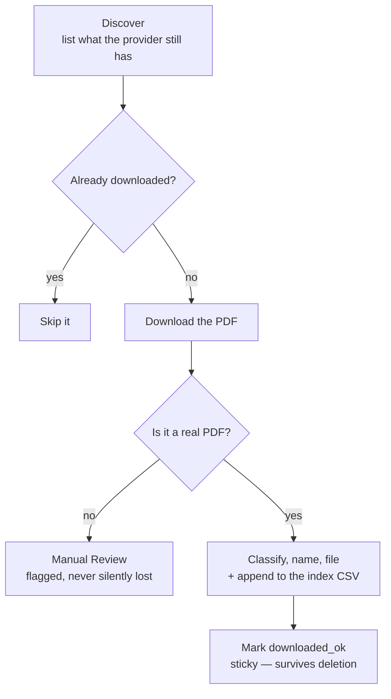

# PaperPull


[](https://ko-fi.com/rheeloaded)

**Receipt & Statement Downloader** — a family of small, **read-only** tools that log in *alongside you* to your own
accounts and download your **statements and receipts** as PDFs — so you can
archive them (e.g. into [paperless-ngx](https://docs.paperless-ngx.com/)) instead
of clicking through each site by hand.

Runs on **Windows and macOS** (and Linux), with the same commands on each.

Twenty-seven providers are supported today, all built on the same pattern:

| App | Provider | Documents | Notes |
|-----|----------|-----------|-------|
| [`aafmaa`](apps/aafmaa) | AAFMAA (Armed Forces Mutual) | Annual statements, policy docs | ASP.NET WebForms; one documented disclosure dialog |
| [`ally`](apps/ally) | Ally Bank | Account statements, tax forms | JSON API; same-dated statements named from the PDF |
| [`amazon`](apps/amazon) | Amazon (any country's store, `marketplace` setting) | Order invoices (full history) | Per-year order pagination |
| [`amex`](apps/amex) | American Express | Statements, Year-End Summary | Click-nav SPA; in-memory session |
| [`anthem`](apps/anthem) | Anthem BCBS (Elevance, 14 Blue states) | EOBs, plan docs (all years), ID cards, letters | Health insurance (PHI); tRPC API, nothing clicked |
| [`capitalone`](apps/capitalone) | Capital One | Bank and card statements, tax forms, letters | Ported; fresh live pilot pending |
| [`chase`](apps/chase) | Chase (credit cards) | Card statements | Real Edge/Chrome; per-card accordions + year picker |
| [`discovercard`](apps/discovercard) | Discover (credit cards) | Card statements | **Capital One is moving these accounts onto its own site. Once yours has moved this app can no longer read it** ([#13](https://github.com/rheeloaded/paperpull/issues/13)) |
| [`dominion`](apps/dominion) | Dominion Energy (VA) | Billing statements | Paginated MUI accordion; ~18-month limit |
| [`gap`](apps/gap) | Gap Inc. (Gap, Old Navy, Banana Republic, Athleta) | Order receipts | Lazy-loading history; ~13-month limit |
| [`mypay`](apps/mypay) | DFAS myPay | eRAS, CRSC, 1099-R, 1095 | Government pay system; JSON API, nothing clicked |
| [`mtb`](apps/mtb) | M&T Bank | Mortgage statements, escrow, 1098 | Own online banking; you list, app expands all years |
| [`navyfederal`](apps/navyfederal) | Navy Federal CU | Account statements | Per-account accordions; blob-tab PDFs |
| [`paylocity`](apps/paylocity) | Paylocity | **Pay statements** | Escher JSON API, enqueue-poll-fetch PDF; nothing clicked |
| [`pge`](apps/pge) | PG&E (Pacific Gas and Electric) | Billing statements | Salesforce portal with a paginated history, fresh live pilot pending |
| [`redcard`](apps/redcard) | Target RedCard / Circle Card (TD Bank) | Billing statements | Statements table; per-year switcher |
| [`robinhood`](apps/robinhood) | Robinhood | Account statements, tax docs | "View More" pagination |
| [`schwab`](apps/schwab) | Charles Schwab | Statements, tax forms, letters, trade confirmations | Ported; fresh live pilot pending |
| [`target`](apps/target) | Target | Receipts (Online + In-Store) | Print-capture |
| [`tmobile`](apps/tmobile) | T-Mobile | Bill statements | Bill-history page; detailed-bill download |
| [`tsp`](apps/tsp) | Thrift Savings Plan | Participant statements, 1099-R | Secure Mailbox API from inside the page, nothing clicked; downloading marks the message read |
| [`ukg`](apps/ukg) | UKG Pro / UltiPro | **Pay statements** | Per-employer tenant; JSON-API, nothing clicked |
| [`usaa`](apps/usaa) | USAA | Statements | JSON-API enumeration |
| [`usbank`](apps/usbank) | U.S. Bank | Credit-card statements | Ported; fresh live pilot pending |
| [`verizon`](apps/verizon) | Verizon (Fios) | Bill statements | Real Edge (bot block); dropdown + CDP download |
| [`walmart`](apps/walmart) | Walmart | Receipts | Hardened against bot detection |
| [`wealthfront`](apps/wealthfront) | Wealthfront | Statements, tax docs | |

> ⚠️ **Read this first:** these tools drive real, signed-in financial accounts.
> See [SECURITY.md](SECURITY.md) before you run *or* publish anything. In short:
> never commit your `*-browser-profile/` folder, your `config.json`, or any
> downloaded PDF. The `.gitignore` blocks them — don't override it.

## How it works (the shared design)

### The one decision everything follows from

Your documents live on the provider's site, and it will only hand them to a
browser that is already signed in. So PaperPull never tries to *be* you — it
works *beside* you. You sign in yourself, in a real browser window, and the
tool attaches to that window afterwards and reads.



That single choice is why there is no password anywhere in this project, why
2FA and device approvals are never an obstacle, and why a provider tightening
its login breaks nothing here.

In practice that first step is `paperpull <app> login` (or the app's own
`login.bat` / `login.command`), which opens the browser for you, a plain
Chromium for most apps, or your own installed Edge/Chrome for the few sites
whose bot detection turns a fresh Chromium away (Walmart, Verizon, Chase).
Each app gets its own profile and its own debugging port, so several
signed-in browsers can sit open at once without colliding.

**Everything a provider knows lives in one file.** `provider_site.py` holds
every selector, URL and download quirk for that site. The orchestrator around
it is the same in every app, and `paperpull-core` underneath it is
shared. When a provider redesigns, the repair is one file — never a rewrite,
and never a change to how documents get named, filed or tracked.

### What one run actually does



Three plain-text files carry the state, and you can read all of them:

| File | Holds |
|------|-------|
| `discovery.json` | what the provider showed us this run |
| `progress.json` | what happened to each document — including the sticky `downloaded_ok` |
| `<Provider> Document Index.csv` | one row per saved document, for humans and spreadsheets (receipt apps also keep an `Order History.csv`, one row per line item) |

That last step is what makes a re-run safe. `downloaded_ok` is keyed to the
document, not to the file on disk — so you can import everything into
paperless-ngx, delete the PDFs, and the next run still skips them. It only
fetches what is genuinely new, and lists it in `new-this-run.txt`.

### Read-only by construction

Nothing that buys, sells, transfers, pays, deletes, or changes a setting is
ever clicked, and all site interaction lives in `provider_site.py` where it can
be read in one sitting. Every app that clicks enforces this deny-by-default, a
control must clear a blocklist (`FORBIDDEN_CONTROL_RE`) *and* match a document
allowlist (`SAFE_DOC_CONTROL_RE`), and the app's host allowlist refuses any
stored URL that points elsewhere. Seven apps click nothing at all (Amazon,
Anthem, Gap, myPay, Paylocity, TSP, UKG), they read a JSON API or render a
page they navigated to. A repo-wide test checks every app's guard.
[SECURITY.md](SECURITY.md) spells out which app does which.

### One app, more than one person

`paperpull <app> all --account spouse` runs one app against a second
person's account, with its own profile, port and output folders, so no data
mixes. Underneath it is a `config.spouse.json` beside the app's `config.json`,
which the app also takes directly as `--config`, and the sign-in launcher
takes the label too (`login.bat spouse` / `./login.command spouse`).

## Quick start


**One-shot setup** (creates a venv for every app + the GUI, installs the browser):

```bat
setup-all.bat        REM Windows
```

```bash
./setup-all.command  # macOS / Linux
```

Then either drive everything from the **[GUI control panel](gui)** — pick an
app and account, click an action, and watch the live output:

```bat
gui\run_gui.bat
```


…or run a single app from the terminal, with one command for all of them
(using `amex` as the example):

```bat
copy apps\amex\config.example.json apps\amex\config.json    REM then edit paths as needed
paperpull amex login            REM opens a browser, sign in yourself, leave it OPEN
paperpull amex pilot            REM download the newest few as a test
paperpull amex all              REM download everything available
paperpull amex resume           REM continue after an interruption
paperpull list                  REM every app it can see
```

`paperpull` is `paperpull.bat` on Windows and `./paperpull` on macOS and
Linux, or `python paperpull.py` anywhere. It finds the app by folder name,
slug or provider, runs it under its own environment, and passes anything else
straight through, so `paperpull chase all --year 2025 --account spouse` works.
The commands are `setup`, `login`, `discover`, `pilot`, `all`, `resume`,
`verify`, `diagnose` and `dry-run`. The panel offers the six of those a
person uses day to day, plus a Scope row (one year, or a date range) that
becomes the same `--year`, `--start-date` and `--end-date` every app takes.

Each app also has its own README with provider-specific details and quirks.
(Prefer to set apps up one at a time? `paperpull <app> setup`, or the app's
own `setup.bat` / `setup.command`.)

## Knowing when to run it again

`tools/status.py` reads the state each app already keeps and reports how current
every archive is. Copy it and `status.bat` next to your install folders and run
it. It downloads nothing and changes nothing.

```
PROVIDER                     DOCS  NEWEST          AGE  ISSUES     STATUS
Some Payroll                   12  2026-06-18     72 d  2x month   !! OVERDUE
A Bank                         97  2026-06-30     60 d  monthly    *  due
A Mortgage                     93  2026-07-31     29 d  monthly       current
A Shop                        667  2026-08-13     16 d  -             ongoing
```

It reports the archives you **have**. Nobody holds an account with every
provider, so a folder you never set up, or one left behind by a closed account,
is left out entirely rather than listed as missing or overdue. An archive that
was set up but never downloaded anything is called out by name, since that is
the one state a single run fixes.

It answers "is something new probably waiting" rather than "when did I last run
this", which are different questions. A run that only verified existing files
still updates a timestamp while telling you nothing about whether a new
statement exists. So the signal is the date of the newest document you actually
hold, measured against how often that provider issues them.

The cadence comes from your own history and is measured per account, so nothing
has to be configured, and a provider that moves from monthly to quarterly
corrects itself. Measuring per account matters: one bank folder can cover
several accounts, and pooling their dates makes a monthly cycle look weekly.
Receipt archives are shown without a due date, because purchases arrive
irregularly and "40 days overdue" would be noise.

### It also looks for holes in the middle

Being up to date is not the same as being complete. An archive can hold a
document from last week and still be missing whole years behind it, which is
exactly what happened twice while building this: one mortgage archive held a
single year of a seven year history, and a payroll archive quietly defaulted to
year to date. Both looked healthy by their newest document.

So each series is also checked for periods that look missing from the middle:

```
Possible gaps. A run that looks current can still be missing
periods in the middle, so these are worth a look.
  A Bank
     2025-03-18 to 2025-05-17   1 missing   3 series, including Savings
     2026-01-01 to 2026-04-02   2 missing   3 series, including Savings
```

The hard part is not finding gaps, it is not inventing them. Plenty of real
documents arrive irregularly, insurance ID cards and policy renewals among
them, where a long quiet stretch means nothing was issued rather than something
was missed. Flagging those would train you to ignore the report, so a series
has to earn an opinion first: at least six documents, a median interval of ten
days or more, and at least 65 percent of its intervals close to that median.
Only then is an interval roughly twice the usual one reported, and it is
reported as possible rather than certain.

Windows shared by several series are grouped, because one account missing a
month is usually a quiet month, while the same window missing across several at
once is what a run that failed part way looks like.

`--html` also writes a `status.html` dashboard you can bookmark, and `--quiet`
prints only what needs attention. The dashboard reads no document contents and
carries no amounts or account numbers, but it does list which providers you
hold accounts with, so it belongs with your installs and is gitignored here.

## Every purchase in one spreadsheet

The receipt apps (Amazon, Target, Walmart, Gap) record every line item they
see while downloading, in an `<Provider> Order History.csv` beside the PDFs.
`tools/export_purchases.py` gathers all of them into one workbook, one row
per item across every provider and account, newest first, with an Orders
sheet and a Summary of spend per provider per year. Amounts are numbers, so
Excel can sum them. Nothing reads a PDF and it takes about a second.

```
python tools/export_purchases.py --root "C:\path\to\your\installs"
```

The panel has the same thing on its **Spreadsheet** tab, one button, with a
dropdown for one provider at a time (`Amazon Purchases.xlsx`). The file is
rebuilt from scratch each time, so edit a copy, not the original.

## The transactions inside your statements

A statement archive holds PDFs, and the transactions are inside them.
`tools/export_transactions.py` opens each PDF a statement archive's index
knows about, reads it line by line, and keeps the lines that have the shape
of a transaction, a date, a description and an amount. Nothing in it is
written for one bank. What makes it trustworthy is the statement itself.
Every statement prints a beginning and an ending balance, and the
transactions between them have to add up.

```
python tools/export_transactions.py --root "C:\path\to\your\installs"
```

Where the statement carries a running balance column, the sign of every
amount is read off the balance and the statement reconciles to the cent by
construction. Where it prints signed amounts, they are summed as printed and
checked against every balance pair the statement shows, which is how a card
statement that prints its summary three times is read right. A statement
covering two accounts is reconciled one account at a time. A statement that
does not add up is still exported, with the difference in the Statements
sheet, so you know which rows to doubt. On the author's archive, every USAA
and Navy Federal statement and 120 of 128 American Express statements
reconcile. Brokerage statements never will, since their balances include
market movement, and the sheet says so.

Amounts are the effect on the balance. Money in is positive, money out is
negative, for a bank account and a card alike. Each PDF is read once and
remembered in a cache beside the installs, so the first build of a big
archive takes minutes and the next takes seconds. The panel's Spreadsheet
tab has this too, under Statements, streaming its progress.

## Windows and macOS

**Both have a package.** Every release on the
[Releases page](https://github.com/rheeloaded/paperpull/releases) carries
`PaperPull-<version>-setup.exe` for Windows, which installs the control
panel, the shared core and every provider into your own user folder with no
admin rights and no Python on the machine, and `PaperPull-<version>.zip`, the
same folder for anyone who would rather not run an installer. For macOS
there is `PaperPull-<version>-arm64.dmg`, Apple Silicon only, signed and
notarized, so it opens with no warning. Drag PaperPull to Applications and
double-click it. The Windows installer is not yet code-signed, so Windows
shows its SmartScreen prompt the first time. See
[Code signing policy](#code-signing-policy) below.

For a checkout of this repository, one download covers both. The two
double-click files each app keeps, and the one-shot setup, come in both
flavours, and everything else is the same `paperpull` command on either:

| Task | Windows | macOS / Linux |
|------|---------|---------------|
| One-shot setup | `setup-all.bat` | `./setup-all.command` |
| Set up one app | `setup.bat` | `./setup.command` |
| Sign in | `login.bat` | `./login.command` |
| Test run | `paperpull amex pilot` | `./paperpull amex pilot` |
| Full run | `paperpull amex all` | `./paperpull amex all` |
| Control panel | `gui\run_gui.bat` | `gui/run_gui.command` |

A second account is the same on both: `paperpull amex all --account spouse`.

Only one thing genuinely differs. macOS keeps Playwright's browser inside an
app bundle and in a different cache directory, and a couple of providers need
a branded Edge/Chrome to get past their bot protection — that lookup lives in
`paperpull_core.browser` and is handled for you.

### Getting a checkout onto a Mac

To use PaperPull, the `.dmg` above is the way. This is for a checkout of the
repository.

**`git clone` is the smoothest route**, it preserves the scripts' executable
bit and macOS does not quarantine it.

If you download a release archive instead, prefer the **`.tar.gz`**: it keeps
the executable bit, while a `.zip` drops it. After unpacking a download,
macOS may also quarantine the scripts, so a double-click reports *"cannot be
opened because it is from an unidentified developer."* Both are cleared in one
go:

```bash
xattr -dr com.apple.quarantine .
chmod +x setup-all.command apps/*/*.command gui/*.command
```

## Requirements

- **Windows, macOS, or Linux**
- For the Windows installer or the macOS `.dmg`, nothing else. They carry
  their own Python.
- For a checkout, Python 3.11+ and Playwright (installed per app by the
  setup script)
- A Chromium-family browser for the few providers that need a real one
  (Chrome, Edge, Brave, Vivaldi or Opera). Safari and Firefox cannot be
  driven this way.

## Contributing — add your provider

No one has accounts everywhere, so **PaperPull grows when people add the
providers they use.** If a bank, card, brokerage, utility, telecom, or retailer
you use isn't here yet, you're the ideal person to add it:

- 📖 **[Adding a provider](docs/adding-a-provider.md)** — a step-by-step guide
  (clone the closest app, rewrite one file, stay read-only, test, submit).
- 📋 **[PROVIDERS.md](PROVIDERS.md)** — what's supported and what's requested;
  claim one so nobody builds it twice.
- 📥 Can't build it yourself? [Request a provider](https://github.com/rheeloaded/paperpull/issues/new/choose)
  and someone with that account may pick it up.

Every contribution keeps the **read-only, local, no-credentials** design — see
[CONTRIBUTING.md](CONTRIBUTING.md) and [SECURITY.md](SECURITY.md).

## Status & roadmap

- ✅ All **twenty-seven** apps pass their tests, more than 1,400 of them across the
  repo. Twenty are in regular use by the author. The other seven (Ally,
  Anthem, Capital One, Discover, PG&E, Schwab, U.S. Bank) were contributed
  by people who hold those accounts, and the four marked in the table above
  are awaiting a fresh live pilot since they were ported.
- ✅ **Packaged.** A Windows installer and a signed, notarized macOS app,
  both built by GitHub Actions from the tagged commit, with checksums. A
  Microsoft Store listing and free open-source code signing for Windows are
  in progress.
- 🔜 **More providers:** community-driven — see [PROVIDERS.md](PROVIDERS.md).
- 🔜 **Scheduled/assisted runs:** a monthly "nudge + sweep" (e.g. the 1st) that
  opens the login browsers and then runs discover + resume across every app once
  you've signed in — delete-safe, so it only grabs what's new. Fully unattended
  runs stay out of scope by design: the tools never store credentials or bypass
  2FA, so a human sign-in stays in the loop (long-session retailer apps may
  tolerate more automation than banks/cards).
- ✅ **Shared core:** the support code the apps used to duplicate now lives once
  in [`core/`](core) as `paperpull-core`. An app declares an `AppSpec` — its
  folders, routing, CSV columns and config defaults — and keeps only its
  orchestrator and its `*_site.py`. `tools/check_installs.py` reports whether
  your installs have drifted from the repo.

## Code signing policy

The Windows installer is built from a tagged commit of this repository by the
[Windows package](.github/workflows/build-windows.yml) workflow on a clean
GitHub runner, never from a developer's machine, and the checksums of what it
produced are published beside it. Signing goes through that same workflow so a
signed binary can only ever come from code that is in this repository.

This program does not transfer any information to other networked systems
unless specifically requested by the user. The only sites it contacts are the
providers you sign in to yourself, and the only download it ever offers is a
browser, at sign-in, with your agreement. The full statement is
[PRIVACY.md](PRIVACY.md).

Team roles, current status and the full policy are in
[docs/code-signing.md](docs/code-signing.md).

## Support

If PaperPull saves you time, you can support its development on Ko-fi:
**[ko-fi.com/rheeloaded](https://ko-fi.com/rheeloaded)** ☕. Entirely optional and
much appreciated — it doesn't change anything below.

## Legal

This project is for **personal archival of your own records**. It is not
affiliated with, endorsed by, or sponsored by any of the companies listed.
All product names and trademarks are the property of their respective owners.
Automating access to a website may be restricted by that site's Terms of
Service — you are responsible for how you use these tools. Provided **as-is,
without warranty of any kind**.

**License.** PaperPull is free software under the
[GNU Affero General Public License, version 3](LICENSE). You can run it,
read it, change it and share it. If you distribute a changed version, or run
one as a service for other people, the same license applies to what you
distribute, source included. Contributions before 2026-09-18 were made under
MIT and that permission is kept, see [NOTICE.md](NOTICE.md).

**Name.** The PaperPull name is not part of the license. A modified version
needs its own name, so that anything called PaperPull is this project. What
that allows and what it doesn't is in [TRADEMARK.md](TRADEMARK.md).
