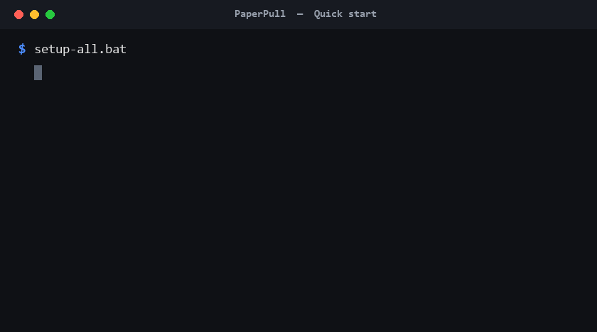

# PaperPull


[](https://ko-fi.com/rheeloaded)

**Receipt & Statement Downloader** — a family of small, **read-only** tools that log in *alongside you* to your own
accounts and download your **statements and receipts** as PDFs — so you can
archive them (e.g. into [paperless-ngx](https://docs.paperless-ngx.com/)) instead
of clicking through each site by hand.

Eleven providers are supported today, all built on the same pattern:

| App | Provider | Documents | Notes |
|-----|----------|-----------|-------|
| [`amazon`](apps/amazon) | Amazon | Order invoices (full history) | Per-year order pagination |
| [`amex`](apps/amex) | American Express | Statements, Year-End Summary | Click-nav SPA; in-memory session |
| [`dominion`](apps/dominion) | Dominion Energy (VA) | Billing statements | Paginated MUI accordion; ~18-month limit |
| [`navyfederal`](apps/navyfederal) | Navy Federal CU | Account statements | Per-account accordions; blob-tab PDFs |
| [`robinhood`](apps/robinhood) | Robinhood | Account statements, tax docs | "View More" pagination |
| [`target`](apps/target) | Target | Receipts (Online + In-Store) | Print-capture |
| [`tmobile`](apps/tmobile) | T-Mobile | Bill statements | Bill-history page; detailed-bill download |
| [`usaa`](apps/usaa) | USAA | Statements | JSON-API enumeration |
| [`verizon`](apps/verizon) | Verizon (Fios) | Bill statements | Real Edge (bot block); dropdown + CDP download |
| [`walmart`](apps/walmart) | Walmart | Receipts | Hardened against bot detection |
| [`wealthfront`](apps/wealthfront) | Wealthfront | Statements, tax docs | |

> ⚠️ **Read this first:** these tools drive real, signed-in financial accounts.
> See [SECURITY.md](SECURITY.md) before you run *or* publish anything. In short:
> never commit your `*-browser-profile/` folder, your `config.json`, or any
> downloaded PDF. The `.gitignore` blocks them — don't override it.

## How it works (the shared design)

Every app follows the same four ideas:

1. **You sign in; the tool attaches.** `login.bat` opens a plain Chromium window
   using that app's own profile and a dedicated debugging port. **You** complete
   sign-in, 2FA, and any device approval yourself. The tool then connects to that
   already-authenticated browser over the Chrome DevTools Protocol (CDP). It
   never sees your password or handles your 2FA.
2. **Read-only by construction.** All site interaction lives in `*_site.py`,
   guarded by a hard blocklist (`FORBIDDEN_CONTROL_RE`) *and* a document
   allowlist (`SAFE_DOC_CONTROL_RE`). Nothing that buys, sells, transfers, pays,
   deletes, or changes a setting can be clicked.
3. **Delete-safe.** Once a document is saved it gets a sticky `downloaded_ok`
   marker. Delete the PDFs after importing them elsewhere and a re-run will
   **not** fetch them again — it only grabs what's genuinely new
   (`new-this-run.txt` lists them each run).
4. **Multi-account.** A `--config config.<name>.json` flag lets one app serve a
   second person's account with its own profile, port, and output folders — no
   data mixing. The `.bat` files take the account label as an argument
   (`login.bat spouse`, `run_all.bat spouse`).

## Quick start



**One-shot setup** (creates a venv for every app + the GUI, installs the browser):

```bat
setup-all.bat
```

Then either drive everything from the **[GUI control panel](gui)**:

```bat
gui\run_gui.bat
```

…or run a single app directly (using `amex` as the example):

```bat
cd apps\amex
copy config.example.json config.json    REM then edit paths as needed
login.bat                 REM opens Chromium — sign in yourself, leave it OPEN
run_pilot.bat             REM download the newest few as a test
run_all.bat               REM download everything available
```

Each app also has its own README with provider-specific details and quirks.
(Prefer to set apps up one at a time? Each has its own `setup.bat`.)

## Requirements

- Windows (the `.bat` launchers are Windows-oriented; the Python is portable)
- Python 3.11+
- Playwright (installed per app via `setup.bat`)

## Status & roadmap

- ✅ All ten apps work and are in regular use.
- 🔜 **Planned providers:** Target RedCard.
- 🔜 **Shared core:** the apps grew independently and duplicate a fair amount of
  support code (`storage.py`, `receipt_pdf.py`, `models.py`). Extracting a shared
  library is a known future cleanup — deferred so as not to destabilize working
  tools. See each app's code for now.

## Support

If PaperPull saves you time, you can support its development on Ko-fi:
**[ko-fi.com/rheeloaded](https://ko-fi.com/rheeloaded)** ☕. Entirely optional and
much appreciated — it doesn't change anything below.

## Legal

This project is for **personal archival of your own records**. It is not
affiliated with, endorsed by, or sponsored by any of the companies listed.
All product names and trademarks are the property of their respective owners.
Automating access to a website may be restricted by that site's Terms of
Service — you are responsible for how you use these tools. Provided **as-is,
without warranty of any kind** (see [LICENSE](LICENSE)).
