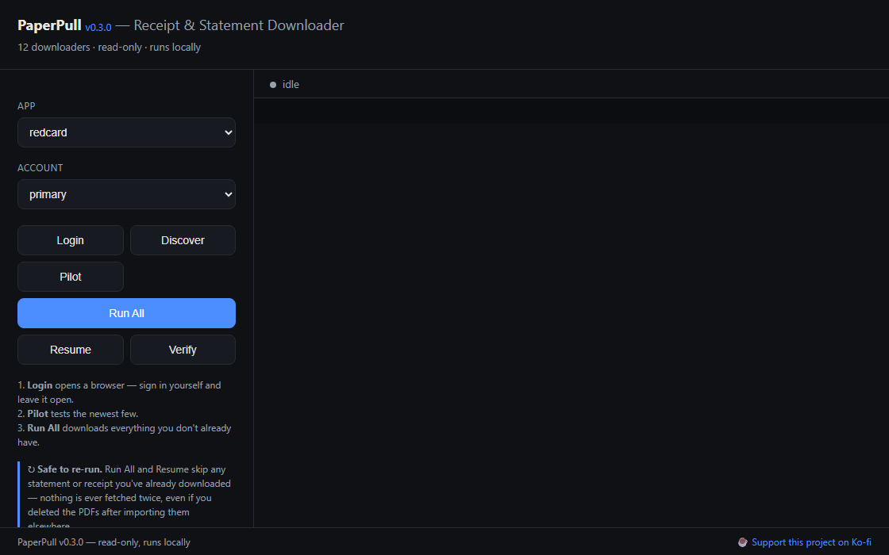

# PaperPull — Control panel (GUI)

A small local web UI that wraps every downloader app: pick an app + account,
click an action, and watch the live output. It only runs the same predefined
commands the `.bat` files do — nothing from the page is passed to a shell.



## Run it

```bat
run_gui.bat
```

That creates a small venv (FastAPI + uvicorn), starts the server, and opens
<http://127.0.0.1:8765>. It listens on localhost only.

Needs **Python 3.11+**, the same floor as the rest of PaperPull.

Closing the browser tab stops the run it was showing. That is deliberate: a
downloader driving your signed-in browser should not keep going once nothing
is watching it. Nothing is lost — a document is only marked done after it is
saved, so the next run picks up exactly where this one stopped.

Or manually:

```bat
python -m venv .venv && .venv\Scripts\activate && pip install -r requirements.txt
python -m uvicorn app:app --port 8765
```

## Which apps does it drive?

By default it discovers the apps in `../apps`. To drive your **existing working
copies** instead (with their venvs, configs, and signed-in profiles already set
up), set `APPS_ROOT` first:

```bat
set APPS_ROOT=C:\path\to\Receipt and Statement Downloader
run_gui.bat
```

It finds any subfolder containing an entry script (`*_receipts.py` /
`*_docs.py`), so it works with either the `apps/<slug>` layout or the original
`Provider Name/` folders. Each app runs with its own `.venv` if present.

## Actions

| Button | What it runs |
|--------|--------------|
| **Login** | Opens that app's browser (Chromium, or Edge/Chrome for bot-protected sites) — **you** sign in and leave it open |
| **Discover** | Enumerate available documents (downloads nothing) |
| **Pilot** | Download the newest few as a test |
| **Run All** | Download everything available (`--yes`, no prompt) |
| **Resume** | Continue an interrupted run |
| **Verify** | Re-check the downloaded PDFs |

## Notes & limits

- **Login is human-driven.** The panel opens the browser; you handle sign-in and
  2FA yourself. That's by design — the tools never touch your password.
- If a run hits a mid-run "please sign in again" prompt (e.g. an expired
  session), it can't answer from here — it will end. Just Login again and Resume.
- One app needs its `.venv` set up (run its `setup.bat` once) before the panel
  can run it; the UI warns when a venv is missing.
